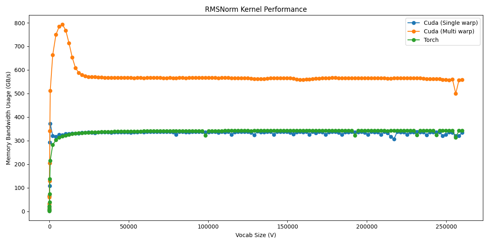

# RMS in CUDA

Note: I wrote the kernel with the convention that columns are along the X axis and rows are along the Y axis inside the block. Convention: B, N, V -> Batch size, Number of tokens, Vocab size or dimension

RMS is one of the easiest kernel to optimze in CUDA. If you have followed [softmax](../softmax/README.md) optimization blog, then this is straight forward.

RMS uses the formula:

$y_i = \frac{x_i}{RMS(x)} * \gamma$

where:

$RMS(x) = \sqrt{\frac{\sum{x_i}^2}{V} + \epsilon}$

There is just one loop to optimize here, which is the summation loop. This is similar to how one would optimize the max or summation in Softmax kernel.

Apart from that, I learned two more things in this kernel

1. Handle tail values in case we are using `float4` loads and `V` is not divisible by 4
2. If I want to use multiple rows per block, I have to handle the SMEM accordingly

## Conclusion

After implementing softmax kernel in CUDA, implementing an optimized RMS CUDA kernel was trivial. And frankly, I was surprised that I was able to get better performance than Torch.

