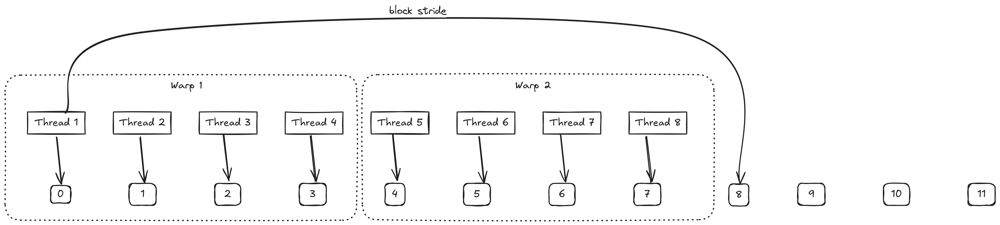
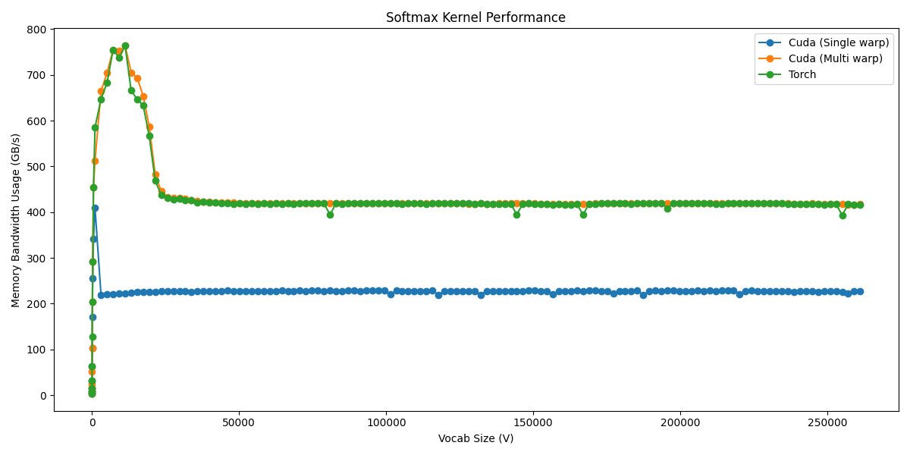

# Softmax in CUDA

Note: I wrote the kernel with the convention that columns are along the X axis and rows are along the Y axis inside the block.

Softmax was a comparatively easier function to optimize in CUDA. This is not a worklog, but a note of optimization tricks.

The main tricks required for optimizing were:

## 1. Use warp level reductions to find the max value in a warp

Warps are groups of 32 threads working in sync and coordinating amongst themselves very efficiently to perform certain operations.

The GPU issues instructions at a warp level. Meaning, it will issue the instructions for 32 threads at a time. If we can coordinate amongst these threads, we get a good speed boost.

> [!WARNING]
> I am not getting into the theory of why that happens, since there are much better references for that!

The first two steps in Softmax are:

1. Find the maximum value of a row
2. Find the exponentiated sum of the values of the row

We can issue multiple warps in a single kernel call. We want to make sure that each thread reads the value from the row strided by the (`number_of_warps * 32`) so that each value in the row is read only once in this step. This stride is also called a block stride (in my terminology). Essentially, all (`number_of_warps * 32`) threads are reading data in a coalesced manner from the array.

> [!TIP]
> Coalesced memory access is when neighbouring threads access neighboring values (in terms of memory address) from the memory.

Each thread maintains the max value it has seen while looping over the row. Now, the warp to which this thread belongs can do a very efficient reduction - `__shfl_xor_sync`. In this reduction, each thread of a warp participates and finds the maximum value amongst itself. This is done by all the warps in the kernel. Once this operation is completed, we will have (number of warps) max values. Store this value in SRAM (by figuring out the index correctly).

Figure 1: A top example with 12 elements in a row, with 2 warps each of size 4 threads (instead of 32). Thread 1 will read values at index 0 and 8. Similarly, for threads numbered 2 to 4. Thead 1 will maintain the maximum value it has seen between index 0 and index 8. After reading all the values, before doing warp reduction, warp 1 will have 4 values stored

1. Thread 1 with max of (index 0, index 8)
2. Thread 2 with max of (index 1, index 9)
3. Thread 3 with max of (index 2, index 10)
4. Thread 4 with max of (index 3, index 11)

When we issue the instruction `__shfl_xor_sync`, it will get the maximum of all 4 values from the threads. The same would happen for all the other threads.

## 2. Block-level reduction to find the max value in a row

Once we have the local maximums from all the warps, we can do a block-level reduction to find the maximum of a row. Now, assuming we have less than 32 warps, we can do another trick where we first collect all the local maximums in the first 32 threads of the block and then do similar `__shfl_xor_sync` amongst those 32 threads to find the final maximum value of the row.

This would give us a global maximum value of the row. But why did we label this as a block-level reduction instead of a thread-level reduction? Because we had to store the intermediate results (local maximum from step 1) in SRAM and then load from there to perform the final reduction.

We follow the same steps for calculating the denominator of the softmax (sum of the exponential of the value). Here, instead of applying max, we apply the exponential operation followed by summation. For safe softmax, we also subtract the global max.

## 3. float4 loads

Another optimization that we can do during loading the values is to issue a `float4` instruction, which essentially loads 4 floats in a single instruction. This reduces the number of steps we need to do to load the values of the array and results in a good speed bump.

## 4. Use pragma unroll

I do not understand this trick completely, but instead of applying a for loop, we unroll the for loop by giving the compiler a hint to write each loop of the for loop as a separate, standalone instruction. It helps with the speed, so why not?

## Conclusion

The most important takeaway from this kernel is to understand warp-level reduction and block-level reduction. The last two optimization tricks are quite common and widely used.

Finally, we get the performance, which is comparable to Pytorch.

